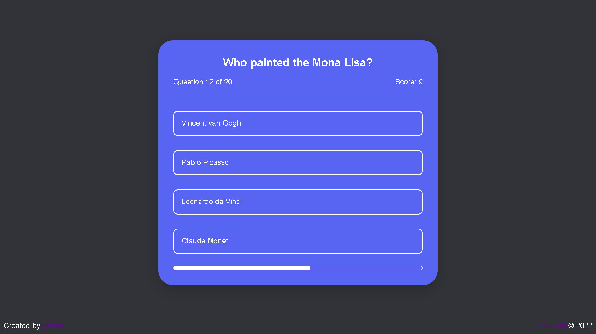

# Quiz Game

An interactive **Quiz Game** built with HTML, CSS, and JavaScript. Test your knowledge, track your score, and see how well you perform!

## Live Demo

**[Play the Quiz](https://quiz-game-one-phi.vercel.app)**

## Preview



## Features

- Multiple-choice questions
- Score tracking
- Instant answer feedback
- Final score display
- Restart the quiz
- Responsive design
- Smooth and interactive user experience
- Clean and modern interface

## Technologies

- **HTML5**
- **CSS3**
- **JavaScript**

## Project Structure

```text
Project-1/
│
├── index.html
├── style.css
├── script.js
├── README.md
└── assets/
    └── ...
```

## How It Works

The quiz displays a series of multiple-choice questions.

For each question, the player selects an answer. The game then checks whether the selected answer is correct and updates the score.

Once all questions have been answered, the player's final score is displayed.

### Example

```text
Question 3/20

What is the largest planet in our Solar System?

○ Earth
○ Mars
○ Jupiter
○ Venus

Score: 2/20
```

## Installation

Clone the repository:

```bash
git clone https://github.com/abdourhd/frontend-projects.git
```

Navigate into the project:

```bash
cd Project-1
```

Then open `index.html` in your browser.

No dependencies or installation are required.

## Author

**Abdou**

- GitHub: [abdourhd](https://github.com/abdourhd)

## License

This project is open-source.
