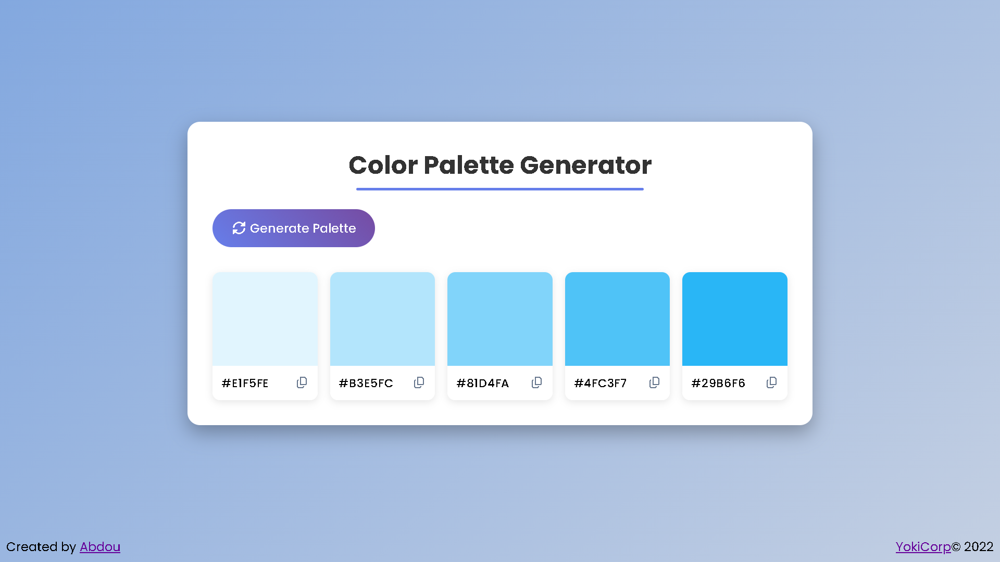

# Random Color Palette Generator

A simple and interactive **Random Color Palette Generator** built with HTML, CSS, and JavaScript.

Generate beautiful random color palettes with a single click and easily copy individual color codes to your clipboard.

## Live Demo

**[Be an Artist](https://random-color-palette-generator-eta.vercel.app)**

## Preview



## Features

- Generate random color palettes
- Generate a new palette with one click
- Copy color HEX codes to the clipboard
- Instant color generation
- Responsive design
- Works on desktop, tablet, and mobile
- Simple and intuitive user interface

## Technologies

- **HTML5**
- **CSS3**
- **JavaScript**

## Project Structure

```text
Project-2/
│
├── index.html
├── style.css
├── script.js
├── README.md
└── assets/
    └── ...
```

## How It Works

The website generates random HEX color values using JavaScript.

Each generated color is displayed as part of the palette, along with its HEX code.

Users can click on a color to copy its HEX value to the clipboard.

### Example

```text
#FF5733
#33FF57
#3357FF
#F3FF33
#A833FF
```

## Installation

Clone the repository:

```bash
git clone https://github.com/abdourhd/frontend-projects.git
```

Navigate into the project:

```bash
cd Project-2
```

Then open `index.html` in your browser.

No dependencies or installation are required.

## Author

**Abdou**

- GitHub: [abdourhd](https://github.com/abdourhd)

## License

This project is open-source.
